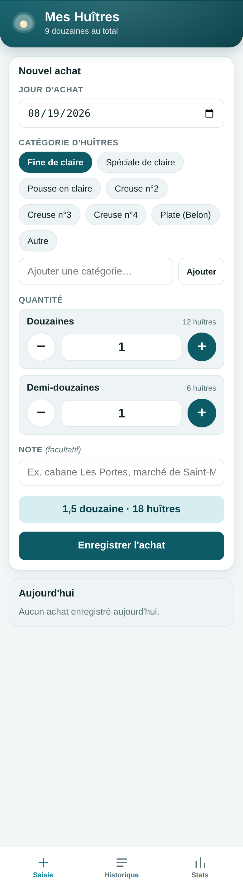
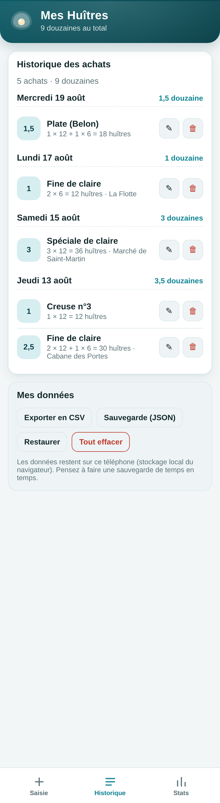
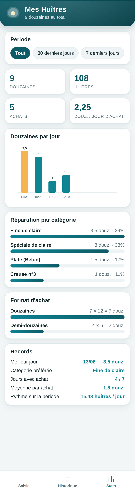

# 🦪 Mes Huîtres — Île de Ré

Petite application pour téléphone qui note **les douzaines et demi-douzaines d'huîtres achetées
pendant les vacances**, avec le jour d'achat, la catégorie d'huîtres, et un **module de
statistiques**.

Pas de compte, pas d'internet nécessaire, pas de publicité : tout est stocké **sur le téléphone**.

| Saisie | Historique | Statistiques |
|---|---|---|
|  |  |  |

---

## Ce que fait l'appli

**Onglet Saisie**
- le **jour d'achat** (par défaut aujourd'hui, modifiable pour rattraper un oubli) ;
- la **catégorie d'huîtres** : fine de claire, spéciale de claire, pousse en claire, creuse n°2/3/4,
  plate (Belon)… et vous pouvez **ajouter vos propres catégories** (elles sont mémorisées) ;
- la **quantité**, avec deux compteurs séparés : **douzaines** (12 huîtres) et
  **demi-douzaines** (6 huîtres). Le total s'affiche en direct : `2,5 douzaines · 30 huîtres` ;
- une **note** facultative (la cabane, le marché…) ;
- un rappel du total **du jour** juste en dessous.

Après un enregistrement la date reste sélectionnée : pratique pour saisir plusieurs
catégories achetées le même jour.

**Onglet Historique**
- tous les achats regroupés par jour, du plus récent au plus ancien, avec le total de chaque jour ;
- **modification** (✎) et **suppression** (🗑) de chaque ligne ;
- **export CSV** (ouvrable dans Excel / Numbers), **sauvegarde JSON** et **restauration**.

**Onglet Stats**
- filtre de période : *tout* / *30 derniers jours* / *7 derniers jours* ;
- 4 indicateurs : total en douzaines, nombre d'huîtres, nombre d'achats, moyenne par jour d'achat ;
- **histogramme des douzaines par jour** (le meilleur jour ressort en orange) ;
- **répartition par catégorie** (en douzaines et en %) ;
- **répartition douzaines / demi-douzaines** ;
- **records** : meilleur jour, catégorie préférée, jours avec achat, moyenne par achat, rythme
  en huîtres par jour.

---

## Installer l'appli sur le téléphone

L'appli est une **PWA** : une page web qui s'installe sur l'écran d'accueil et s'ouvre
en plein écran, comme une vraie application, **même sans réseau**.

### 1. Mettre les fichiers en ligne (une seule fois, sur ordinateur)

Le plus simple est **GitHub Pages** :

1. sur GitHub, ouvrir ce dépôt → **Settings** → **Pages** ;
2. dans *Build and deployment*, choisir **Deploy from a branch** ;
3. sélectionner la branche `claude/oyster-tracking-app-s6imu9` (ou `main` après fusion),
   dossier `/ (root)`, puis **Save** ;
4. après une minute, l'adresse s'affiche en haut de la page :
   `https://pepetechia.github.io/Huitres-il-de-re/`

### 2. Ajouter l'appli à l'écran d'accueil (sur le téléphone)

- **iPhone / iPad (Safari)** : ouvrir l'adresse → bouton **Partager** (le carré avec la flèche)
  → **Sur l'écran d'accueil** → *Ajouter*.
- **Android (Chrome)** : ouvrir l'adresse → menu **⋮** → **Ajouter à l'écran d'accueil**
  (ou la bannière *Installer l'application*).

L'icône « Mes Huîtres » apparaît alors avec les autres applications. Une fois ouverte une
première fois, elle fonctionne **hors connexion** (plage, marché, cabane sans réseau).

### Essayer sur ordinateur, sans rien mettre en ligne

```bash
git clone https://github.com/PepetechIA/Huitres-il-de-re.git
cd Huitres-il-de-re
python3 -m http.server 8000
```

Puis ouvrir <http://localhost:8000>. (Un simple double-clic sur `index.html` marche aussi,
mais le mode hors-ligne ne s'active qu'en `http(s)://`.)

---

## Vos données

- Elles sont enregistrées dans le **stockage local du navigateur du téléphone**
  (clé `huitres-ile-de-re.v1`), et ne partent nulle part : aucun serveur, aucun compte.
- Conséquence : elles sont liées à ce téléphone et à ce navigateur. Si vous effacez les données
  de navigation ou changez de téléphone, elles sont perdues.
- D'où les boutons **Sauvegarde (JSON)** et **Restaurer** dans l'onglet *Historique* :
  un fichier de sauvegarde de temps en temps (à la fin des vacances par exemple) permet de
  tout retrouver ailleurs.
- **Exporter en CSV** donne un tableau `Date ; Catégorie ; Douzaines ; Demi-douzaines ;
  Total douzaines ; Nb huîtres ; Note`, séparé par des points-virgules et encodé en UTF-8
  avec BOM — il s'ouvre directement dans Excel en français.

---

## Contenu du dépôt

| Fichier | Rôle |
|---|---|
| `index.html` | structure de l'appli (3 onglets) |
| `app.css` | mise en forme mobile, thème clair **et** sombre automatique |
| `app.js` | logique : saisie, historique, statistiques, export/import, stockage local |
| `sw.js` | *service worker* : mise en cache pour le fonctionnement hors connexion |
| `manifest.webmanifest` | déclaration PWA (nom, icônes, couleurs, plein écran) |
| `icons/` | icônes de l'application (180/192/512 px + version *maskable* Android) |
| `docs/` | captures d'écran du README |

Aucune dépendance, aucun compte, aucune étape de compilation : du HTML, du CSS et du
JavaScript standard.

### Mettre à jour l'appli installée

Après avoir modifié le code, incrémenter la version du cache dans `sw.js`
(`const CACHE = 'huitres-v1';` → `'huitres-v2'`), sinon les téléphones qui ont déjà installé
l'appli continueront de servir l'ancienne version depuis leur cache.
